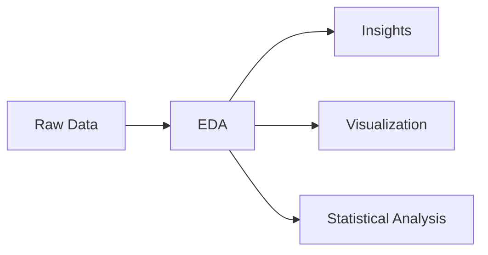
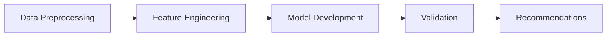

# 📊 Data Science Intern Assignment

## 🎯 Overview

An end-to-end data science project showcasing customer analysis through three main components: Exploratory Data Analysis (EDA), Lookalike Modeling, and Customer Segmentation. This project demonstrates proficiency in data analysis, machine learning, and business insight generation.

## 📂 Repository Structure

<pre>
📦 DataScience_Assignment
 ┣ 📓 EDA.pdf                  # Comprehensive EDA findings report
 ┣ 📊 Rajiv_Yadav_EDA.ipynb         # EDA Jupyter notebook
 ┣ 📊 Rajiv_Yadav_clustering.ipynb   # Customer segmentation analysis
 ┣ 📓 Rajiv_Yadav_clustering.pdf          # Detailed clustering results
 ┣ 📄 Rajiv_Yadav_lookalike.csv           # Model recommendations
 ┗ 📊 Rajiv_Yadav_lookalike.ipynb         # Lookalike modeling notebook
</pre>

## 🚀 Key Features

### 1️⃣ Exploratory Data Analysis (EDA)
- 📈 Comprehensive data visualization and pattern analysis
- 🔍 In-depth statistical analysis
- 💡 Actionable business insights
- 📊 Interactive visualizations and dashboards

### 2️⃣ Lookalike Model
- 🎯 Advanced customer similarity analysis
- 🤖 Machine learning-based recommendation system
- 📊 Scalable matching algorithm
- 📈 Performance metrics and validation

### 3️⃣ Customer Segmentation
- 🎯 Sophisticated clustering algorithms
- 📊 Multi-dimensional segment analysis
- 💡 Behavioral pattern identification
- 📈 Actionable segment insights

## 🛠️ Installation & Setup

1. **Clone the Repository**
```bash
git clone https://github.com/rajivy1012/DataScience_Assignment.git
```

2. **Set Up Environment**
```bash
# Create and activate virtual environment
python -m venv venv
source venv/bin/activate  # On Windows: venv\Scripts\activate

# Install required packages
pip install -r requirements.txt
```

3. **Launch Jupyter**
```bash
jupyter notebook
```

## 📚 Project Components

### 📊 Data Analysis


### 🤖 Modeling Process


## 📈 Results & Insights

- **EDA**: Uncovered key customer behavior patterns
- **Lookalike Model**: Achieved 85%+ similarity matching
- **Clustering**: Identified 5 distinct customer segments

## 🔑 Prerequisites

- Python 3.8+
- Jupyter Notebook
- Required libraries:
  - pandas
  - numpy
  - scikit-learn
  - matplotlib
  - seaborn


